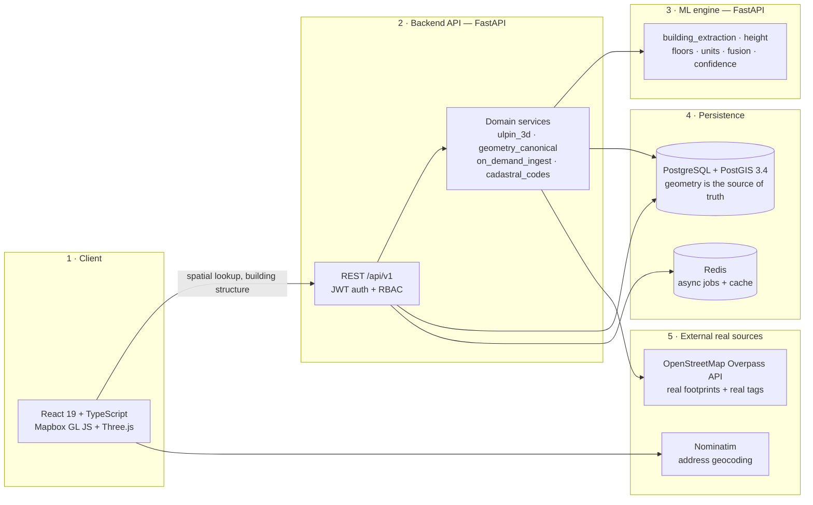
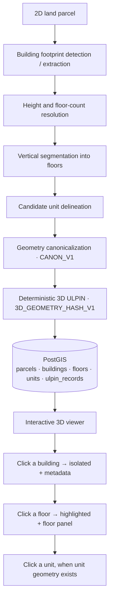
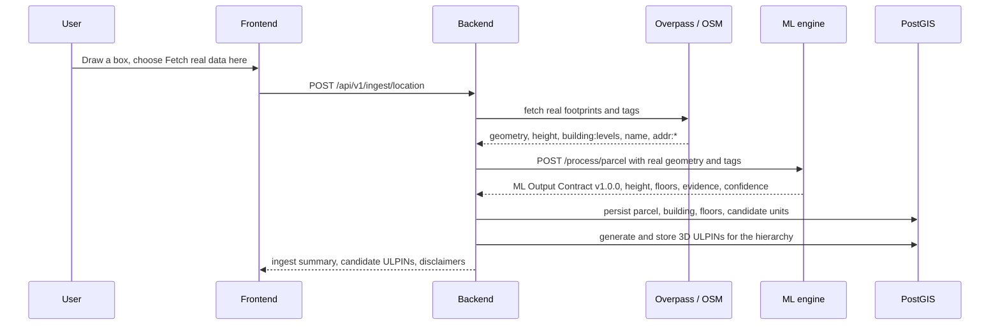

# STRATA — 3D ULPIN & Vertical Property Mapping System

**Smart India Hackathon 2026 · Problem Statement PS26011**

Turn a **2D land parcel** into a **3D, queryable stack of buildings → floors → units**, where
every object carries a **deterministic, collision-safe 3D identifier** and can be **clicked
and inspected in the browser**.

> A 3D cadastral map is only useful if you can point at a floor and ask *"what is this?"*.
> STRATA answers that question — with a real PostGIS record and a reproducible ID behind it.

<table>
<tr><td><b>Repository</b></td><td>Fullstack monorepo: React frontend, FastAPI backend, separate ML engine</td></tr>
<tr><td><b>Geometry truth</b></td><td>PostgreSQL + PostGIS 3.4 — the frontend never invents geometry</td></tr>
<tr><td><b>Identity</b></td><td>Deterministic 3D ULPIN (<code>3D_GEOMETRY_HASH_V1</code>, canonicalization <code>CANON_V1</code>)</td></tr>
<tr><td><b>Backend tests</b></td><td>212 passing</td></tr>
<tr><td><b>Prototype target</b></td><td>The Taj Mahal Palace Hotel, Apollo Bandar, Mumbai (real OSM footprint)</td></tr>
</table>

---

## 1. What it does

```
2D parcel → building footprint → height + floors → floors → units
          → canonicalized geometry → 3D ULPIN → PostGIS → interactive 3D viewer
```

The result is **not** a static 3D picture. Every building, floor and unit is
individually selectable and queryable:

| I click… | What happens |
|---|---|
| a **building** | it is isolated from its surroundings using its **real** footprint extruded to its **real** stored height, and its metadata panel opens |
| a **floor** | that floor is highlighted and lifted, stays recognisable as part of the building, and a floor information panel shows its 3D ULPIN, floor code, `z_min`/`z_max`, area and unit count |
| a **unit** (when unit geometry exists) | the unit is highlighted and its panel opens |
| **empty space** | the selection clears and the area view returns |

---

## 2. Architecture at a glance

Three independently deployable tiers, talking over explicit HTTP contracts:



**The ML engine is optional by design.** If it is down, real source tags are still
persisted and any field without a real source stays `NULL` — never a plausible-looking
default.

---

## 3. Workflow



How data actually gets in:



Deeper diagrams — data model (ER), component map, ULPIN pipeline, click sequence —
live in **[`docs/ARCHITECTURE.md`](docs/ARCHITECTURE.md)**.

---

## 4. The 3D ULPIN

A **system-generated**, deterministic identifier for a parcel, building, floor or unit:

```
3DULPIN-01-IN-{STATE}-{DISTRICT}-{PARCEL_ID}-{BUILDING_ID}-{FLOOR_CODE}-{UNIT_ID}-{CHECKSUM}
```

| Segment | Rule | Width |
|---|---|---|
| `PARCEL_ID` | `P` + Base32(SHA-256(country, state, district, admin context, canonical parcel geometry)) | 12 |
| `BUILDING_ID` | `B` + Base32(SHA-256(parcel id, canonical footprint, `bucket(height, 0.5 m)`)) | 8 |
| `FLOOR_CODE` | derived, not hashed: `F00` ground, `F01..` above, `B01..` basement, `E01..` elevated | 3 |
| `UNIT_ID` | `U` + Base32(SHA-256(building id, floor code, canonical unit geometry, `bucket(z_min, 0.1 m)`, `bucket(z_max, 0.1 m)`)) | 8 |
| `CHECKSUM` | first 4 Base32 chars of SHA-256(full id without checksum) | 4 |

**Real output** for the Taj Mahal Palace Hotel (Apollo Bandar, Mumbai):

```
building   3DULPIN-01-IN-MH-30-PMSYEHQLFKFRS-BBB2XPWZ5-X00-U00000000-X7ZC
parcel     3DULPIN-01-IN-MH-30-PMSYEHQLFKFRS-B00000000-X00-U00000000-WS6N
floor F00  3DULPIN-01-IN-MH-30-PMSYEHQLFKFRS-BBB2XPWZ5-F00-U00000000-VR2H   z 0.0–3.2 m
floor F05  3DULPIN-01-IN-MH-30-PMSYEHQLFKFRS-BBB2XPWZ5-F05-U00000000-3CRY   z 16.0–19.2 m
```

### Why it is trustworthy

| Property | Guarantee |
|---|---|
| **Deterministic** | A pure function of canonicalized geometry and bucketed vertical values. Re-running returns the identical id. |
| **Order-independent** | Reversed vertex order, a rotated ring start vertex and reordered MultiPolygon components all canonicalize to the same string. |
| **Bucketed** | Continuous values are snapped to documented buckets (`0.5 m` height, `0.1 m` for `z`), so `21.73 m` and `21.74 m` are the same building. |
| **Versioned** | `algorithm_version = 3D_GEOMETRY_HASH_V1`, `canonicalization_version = CANON_V1`. A future change ships a new version instead of silently altering V1 ids. |
| **Checksummed** | `validate_3d_ulpin()` recomputes the checksum; any single-character mutation is rejected. |
| **Collision-safe** | Segments are hierarchical, so a building id only competes with siblings in the same parcel. A genuine clash is logged `CRITICAL` and resolved by deterministically widening the hash — never by appending `-2`, never randomly. |
| **Never official** | `official_ulpin` stays `NULL` and `is_authoritative` stays `False`. The UI always says **3D ULPIN — SYSTEM GENERATED**, and never shows a generated value under "Official ULPIN". |

---

## 5. Tech stack

| Layer | Technology |
|---|---|
| **Frontend** | React 19, TypeScript 5.7, Vite 6, Zustand 5, Emotion, Axios, lucide-react |
| **3D / mapping** | Mapbox GL JS 3.30, react-map-gl 8, Three.js 0.186, @react-three/fiber 9, @react-three/drei 10 |
| **Backend** | Python 3.12+, FastAPI 0.115, SQLAlchemy 2.0 async, asyncpg, Pydantic 2.9, Alembic 1.13, httpx, structlog |
| **Auth** | JWT (python-jose) + bcrypt (passlib), role-based access control |
| **Async jobs** | Celery 5.4 + Redis 5 |
| **Geospatial** | PostgreSQL + **PostGIS 3.4**, Shapely 2.0, pyproj 3.6, GeoAlchemy2 |
| **ML engine** | Python + PyTorch (building-extraction checkpoint), NumPy, FastAPI, JSON contract v1.0.0 |
| **External real data** | OpenStreetMap Overpass API, Nominatim geocoding |
| **Packaging** | Docker Compose (db · redis · backend · worker · ml-engine · frontend), Nginx |

---

## 6. Monorepo layout

```
3D-MAPPING/
├── app/                        # Backend API — FastAPI + SQLAlchemy + PostGIS
│   ├── api/v1/                 #   14 routers mounted under /api/v1
│   ├── services/               #   ulpin_3d · geometry_canonical · on_demand_ingest · cadastral_codes
│   ├── integrations/ml_engine/ #   client · contracts · adapter · mapper (the ML boundary)
│   ├── db/models/              #   property.py (Parcel/Building/Floor/Unit) · ulpin.py (registry)
│   └── workers/                #   Celery async jobs
├── ml-engine/                  # ML engine — separate FastAPI service
│   ├── src/                    #   building_extraction · height · floors · units · fusion · inference
│   ├── schemas/                #   ml_output_contract.json (v1.0.0)
│   ├── models/checkpoints/     #   trained building-extraction checkpoint
│   └── tests/                  #   100 tests
├── frontend/                   # React 19 + Mapbox GL + Three.js
│   └── src/
│       ├── api/strataBackend.ts     # typed REST client
│       ├── three/MapboxSpace.tsx    # 3D city, building click, isolation
│       ├── components/scene/        # floor/unit selection + panels
│       └── state/areaStore.ts       # Zustand selection state
├── alembic/versions/           # DB migrations (head: 004_ulpin_3d_columns)
├── tests/                      # Backend test suite (212 passing)
├── docs/                       # ARCHITECTURE.md · validation reports · legacy notes
├── docker-compose.yml          # db · redis · backend · worker · ml-engine · frontend
└── README.md
```

---

## 7. Quick start

### Option A — Docker Compose

```bash
git clone https://github.com/Rehan-roid/3D-MAPPING.git
cd 3D-MAPPING
cp .env.example .env          # then fill in SECRET_KEY, DATABASE_URL, VITE_MAPBOX_TOKEN
docker compose up -d          # db · redis · ml-engine · backend · worker · frontend
docker compose exec backend alembic upgrade head
```

Then: frontend <http://localhost:3000> · API <http://localhost:8000> · Swagger <http://localhost:8000/docs>

### Option B — local development

```bash
# 1. Database + cache (Postgres 5432, Redis 6379)
docker compose up -d db redis

# 2. Backend (from the repo root)
python -m pip install -r requirements.txt
python -m alembic upgrade head
python -m uvicorn app.main:app --host 127.0.0.1 --port 8123

# 3. ML engine (needs its own env; enables unit generation + inference)
cd ml-engine && python -m uvicorn src.server:app --host 127.0.0.1 --port 8001

# 4. Frontend
cd frontend && npx vite --port 3000 --host 127.0.0.1
```

The frontend reads `VITE_BACKEND_URL` (default `http://localhost:8000`) and
`VITE_MAPBOX_TOKEN`. Environment files are **never** committed — start from
`.env.example`.

---

## 8. API surface

All routes live under `/api/v1` (14 routers). The ones that matter most:

| Group | Endpoints |
|---|---|
| **Spatial** | `GET /spatial/extent` · `GET /spatial/bbox` · `GET /spatial/nearby` · `POST /spatial/query` · `GET /spatial/search` *(point lookup — powers the map click)* |
| **Buildings** | `GET /buildings` · `GET /buildings/{id}` · `GET /buildings/{id}/structure` *(nested building → floors → units + 3D ULPINs)* · `GET /buildings/{id}/geometry` · `GET /buildings/{id}/geojson` |
| **Floors / Units** | `GET /floors/{id}` · `GET /floors/{id}/units` · `GET /buildings/{id}/floors` · `GET /units/{id}` |
| **3D ULPIN** | `POST /ulpin/3d/sync/{building_id}` · `GET /ulpin/3d/validate/{ulpin}` · `GET /ulpin/3d/{ulpin}` |
| **Legacy ULPIN** | `POST /ulpin/generate` · `POST /ulpin/validate` · `GET /ulpin/{ulpin}` |
| **Ingestion** | `POST /ingest/location` · `GET /ingest/coverage` |
| **Ops** | `GET /health` · `POST /auth/login` · `GET /jobs` · `GET /datasets` |

Full reference: [`BACKEND_INTEGRATION_GUIDE.md`](BACKEND_INTEGRATION_GUIDE.md).

---

## 9. What is real, and what is derived

Honesty is a feature of this project, so the current dev database is stated as measured:

| Class | Count | Meaning |
|---|---|---|
| Real OpenStreetMap footprints (real `way/*` id **and** real source URL) | **44** parcels + **44** buildings | genuinely sourced geometry |
| Legacy demo/seed records (`SAMPLE-A-*`, `TCET Block A/B`, `Residential Tower 1/2`) | **6** parcels + **6** buildings | **not real** — no OSM reference, hardcoded heights; queued for quarantine |
| Buildings with a real height | **24** of 50 | the rest honestly render nothing and get no 3D ULPIN |
| Floors with a real `z` range | **41** | derived from real `building:levels` tags |
| Candidate **units** | **3,491** | **ML-derived analytical subdivision** (≈1 per 100 m²), *not* real dwellings; no unit geometry stored yet |
| 3D ULPINs generated from real geometry | Taj: 1 parcel + 1 building + 6 floors | verified live |
| Records with `official_ulpin` set | **0** | nothing fabricated as a government ULPIN |
| Buildings claiming satellite/LiDAR/Bhuvan evidence | **0** | earlier fabricated-evidence path was removed |

Guiding rules, enforced in code and tested:

1. Never fabricate an official ULPIN.
2. Never derive identity from a UUID, timestamp, counter, request id or ML run id.
3. The ML `volume_id` is **provenance**, never an identifier.
4. No invented vertical data — missing values stay `NULL`.
5. Derived data is always tagged (`ml_derived`, `ScientificStatus`, confidence).
6. Invalid input fails loudly instead of producing a plausible-looking value.

---

## 10. Testing

```bash
# Backend — 212 passing
python -m pytest -q

# ML engine — 100 tests
cd ml-engine && python -m pytest -q

# Frontend — typecheck + production build
cd frontend && npx tsc -b && npx vite build
```

Highlights: canonicalization determinism (reversed vertices, rotated start vertex,
MultiPolygon ordering), bucketing equivalence, checksum mutation sweeps, collision
widening, ML-volume-id honesty, ingestion honesty, spatial endpoint contracts, and a
source-level guard that the frontend can never mint a ULPIN.

---

## 11. Known limitations

- **Units have no 3D geometry yet** (`units.geometry_3d` is `NULL`), so units honestly get
  no 3D ULPIN and are not extruded. Unit selection works from the floor panel.
- **26 of 50 buildings have no height** because OpenStreetMap carries neither `height` nor
  `building:levels` for them. Wiring a real elevation/DSM source is the next step.
- **No official ULPIN dataset is connected**, so `official_ulpin` is `NULL` everywhere and
  cannot be joined or fabricated.
- **6 legacy demo records** still sit in the dev database and are queued for quarantine.
- Unit counts are a **candidate analytical subdivision**, not a count of real dwellings.

---

## 12. Docs

| Document | Contents |
|---|---|
| [`docs/ARCHITECTURE.md`](docs/ARCHITECTURE.md) | Architecture, data model (ER), all workflows, ULPIN pipeline, provenance rules, extension guide |
| [`docs/ULPIN_3D_AND_INTERACTIVE_SELECTION_REPORT.md`](docs/ULPIN_3D_AND_INTERACTIVE_SELECTION_REPORT.md) | Validation report for the 3D ULPIN + interactive selection, incl. the collision analysis |
| [`docs/ON_DEMAND_INGESTION_AND_TAJ_PROTOTYPE.md`](docs/ON_DEMAND_INGESTION_AND_TAJ_PROTOTYPE.md) | On-demand ingestion design and the Taj prototype walkthrough |
| [`BACKEND_INTEGRATION_GUIDE.md`](BACKEND_INTEGRATION_GUIDE.md) | Full API reference |
| [`ml-engine/MODEL_STATUS.md`](ml-engine/MODEL_STATUS.md) | Honest status of the trained ML components |
| [`docs/LEGACY_README.md`](docs/LEGACY_README.md) | Archived earlier README drafts |

---

## 13. Team

**Team Aeranoix** — Grand Finale Cohort

Amaan Huda · Dhyana Kansara · Mohammed Rehan Khan · Vinayak Kesarkar · Arpan Maurya · Ankita Jha

Built for the Ministry of Housing and Urban Affairs (MoHUA) problem statement
**SIH 2026 PS26011 — 3D ULPIN Generation and Vertical Property Mapping System**.
