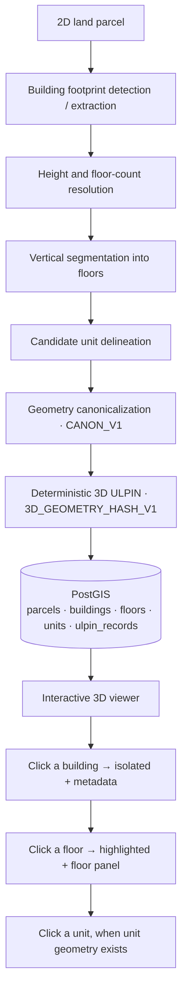
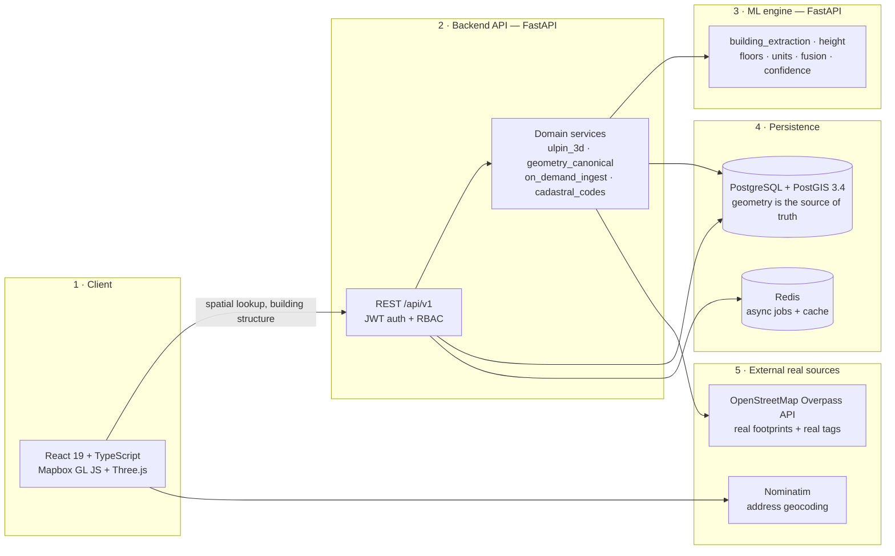
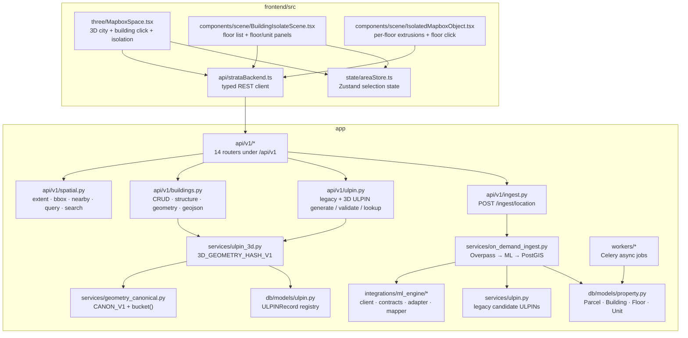
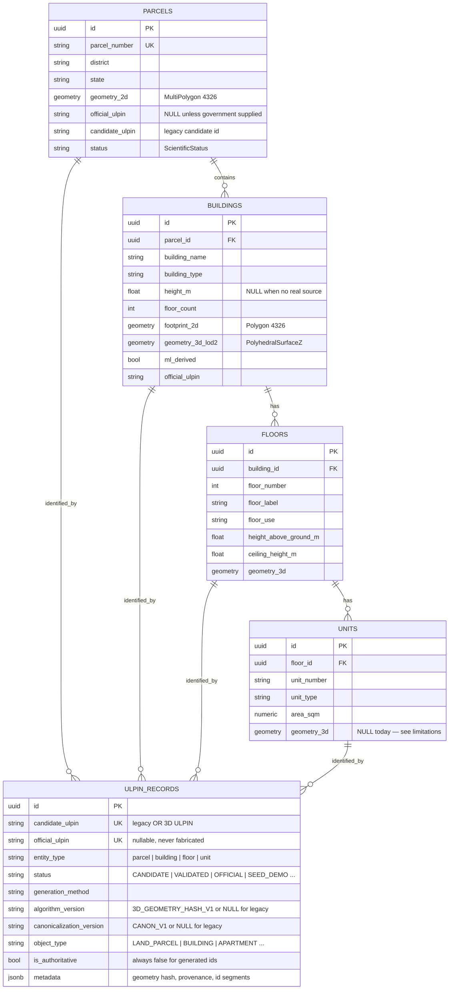
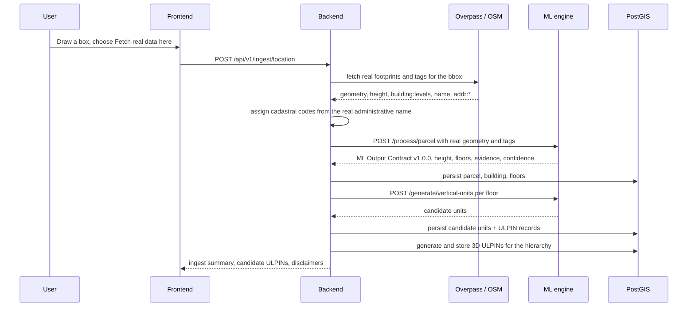
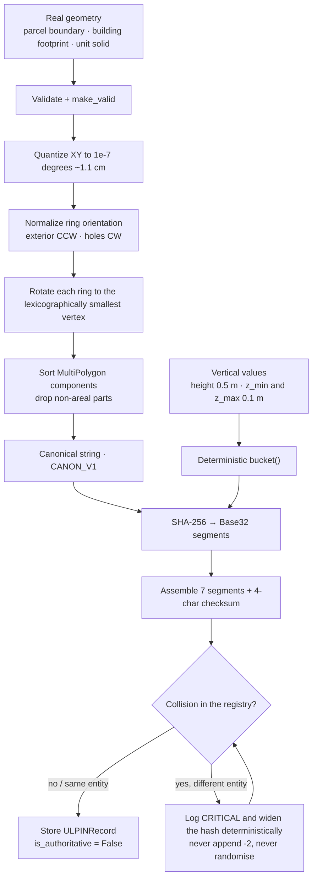
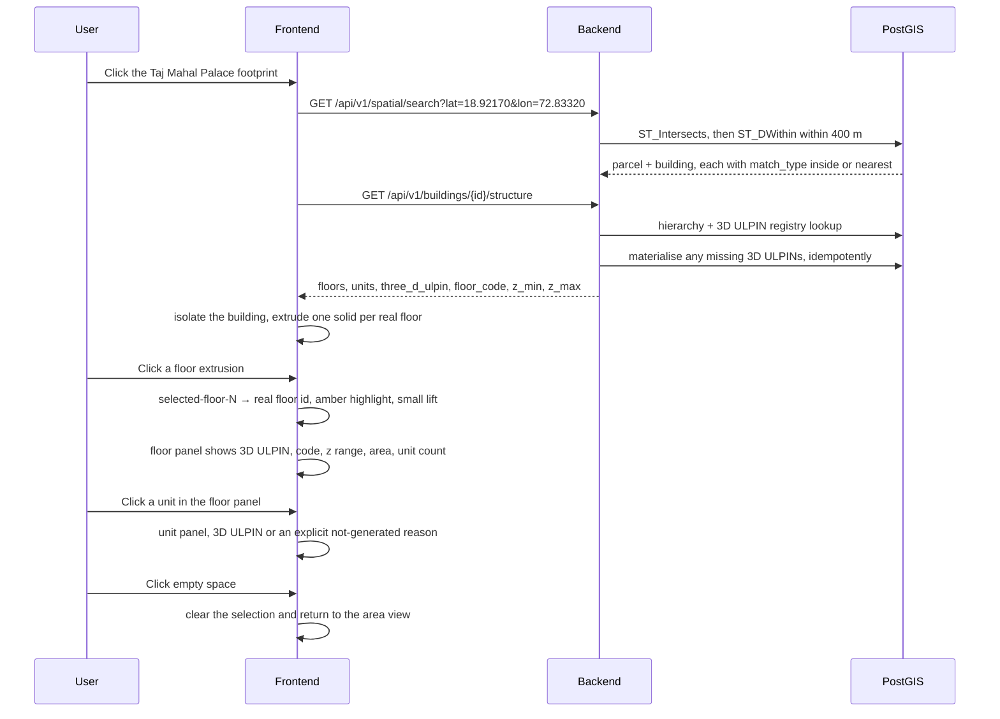

# STRATA — System Architecture, Workflows & Data Model

> Companion to the top-level [`README.md`](../README.md). This document is the
> deep dive: how the pieces fit, how data flows, how the 3D ULPIN is computed,
> and where the honesty rules live.
>
> Diagrams are [Mermaid](https://mermaid.js.org/) and render directly on GitHub.

**Contents**

1. [System at a glance](#1-system-at-a-glance)
2. [The three services](#2-the-three-services)
3. [Component architecture](#3-component-architecture)
4. [Data model](#4-data-model)
5. [Workflow A — on-demand ingestion of real geometry](#5-workflow-a--on-demand-ingestion-of-real-geometry)
6. [Workflow B — deterministic 3D ULPIN generation](#6-workflow-b--deterministic-3d-ulpin-generation)
7. [Workflow C — interactive 3D selection](#7-workflow-c--interactive-3d-selection)
8. [The identity system in detail](#8-the-identity-system-in-detail)
9. [Provenance and honesty rules](#9-provenance-and-honesty-rules)
10. [Tech stack](#10-tech-stack)
11. [Environments, ports, migrations](#11-environments-ports-migrations)
12. [Testing](#12-testing)
13. [Extension guide](#13-extension-guide)

---

## 1. System at a glance

STRATA turns a **2D land parcel** into a **3D, queryable, individually
identifiable stack of floors and units**, and gives every object a
deterministic identifier — the **3D ULPIN**.



The system is **not** a static visualisation: every cadastral object in it is
selectable and queryable, and its identifier is a pure function of its real
geometry.

---

## 2. The three services

| Service | Path | Role | Runtime |
|---|---|---|---|
| **Frontend** | `frontend/` | Map selection, 3D city view, building isolation, floor/unit selection and information panels | React 19 + Vite 6, served by Nginx in Docker |
| **Backend API** | `app/` | REST API, auth/RBAC, spatial queries, cadastral persistence, ULPIN registry, on-demand ingestion orchestrator | FastAPI + SQLAlchemy async, uvicorn |
| **ML engine** | `ml-engine/` | Building extraction, height/floor inference, vertical unit delineation, confidence + evidence fusion, ML Output Contract v1.0.0 | FastAPI, separate process, independent deploy |

They communicate **only** over HTTP with explicit Pydantic contracts, so any one
of them can be replaced without touching the others.



**Design rules**

- **PostGIS is the single source of truth for geometry.** The frontend never
  invents geometry; it renders what the API returns.
- The backend is the **only** writer of cadastral records and ULPINs.
- The ML engine is **optional**: if it is unavailable, real source tags are still
  persisted and fields with no source stay `NULL` (never defaulted).

---

## 3. Component architecture



---

## 4. Data model

The cadastral hierarchy is `Parcel → Building → Floor → Unit`, with a single
**ULPIN registry** that identifies any of the four levels.



**Key modelling decisions**

- One registry table for all four levels (`ULPINRecord`), not four tables.
- `official_ulpin` is a separate, government-only column that this system
  **never** writes; generated identifiers live in `candidate_ulpin`.
- The hierarchy is versioned and temporal: `version`, `valid_from`, `valid_to`,
  `is_active`, `deleted_at`.
- PostGIS GiST indexes back the spatial queries
  (`idx_parcels_geom`, `idx_buildings_footprint`).
- Units have a unique `(floor_id, unit_number)` index; floors a unique
  `(building_id, floor_number)` index.

---

## 5. Workflow A — on-demand ingestion of real geometry

Any Indian coordinate can be researched on demand. Nothing is fabricated: if
the source has no height, the field stays `NULL`.



Idempotency: the natural key is the OSM reference (`way/28846517`). Re-running
the same request updates nothing and creates no duplicates.

---

## 6. Workflow B — deterministic 3D ULPIN generation



Floor codes are **derived, not hashed**: `F00` ground, `F01..` above ground,
`B01..` basement, `E01..` elevated.

---

## 7. Workflow C — interactive 3D selection



Selection state lives in the existing Zustand store
(`selectedFloorId`, `selectedUnitId`) and is shared by the viewer, the floor
list and the information panels.

---

## 8. The identity system in detail

### Anatomy

```
3DULPIN - 01 - IN - {STATE} - {DISTRICT} - {PARCEL_ID} - {BUILDING_ID} - {FLOOR_CODE} - {UNIT_ID} - {CHECKSUM}
```

| Segment | Rule | Width |
|---|---|---|
| `PARCEL_ID` | `P` + Base32(SHA-256(country, state, district, administrative context, canonical parcel geometry)) | 12 chars |
| `BUILDING_ID` | `B` + Base32(SHA-256(parcel id, canonical footprint, `bucket(height, 0.5)`)) | 8 chars |
| `FLOOR_CODE` | derived from the floor number, not hashed | 3 chars |
| `UNIT_ID` | `U` + Base32(SHA-256(building id, floor code, canonical unit geometry, `bucket(z_min, 0.1)`, `bucket(z_max, 0.1)`)) | 8 chars |
| `CHECKSUM` | first 4 Base32 chars of SHA-256(full id without checksum) | 4 chars |

Real, verified example (the Taj Mahal Palace Hotel, Apollo Bandar, Mumbai):

```
3DULPIN-01-IN-MH-30-PMSYEHQLFKFRS-BBB2XPWZ5-X00-U00000000-X7ZC
```

Aggregate levels use sentinels that no real hash can produce (`0` is not in the
Base32 alphabet `A-Z2-7`): `B00000000` no building, `X00` no floor,
`U00000000` no unit.

### Properties

| Property | How it is guaranteed |
|---|---|
| **Deterministic** | Pure function of canonicalized geometry + bucketed vertical values. Re-running returns the identical id. |
| **Order-independent** | Reversed vertex order, rotated ring start and reordered MultiPolygon components all canonicalize identically. |
| **Versioned** | `algorithm_version = 3D_GEOMETRY_HASH_V1`, `canonicalization_version = CANON_V1`. A future change ships a new version rather than silently changing V1 ids. |
| **Checksummed** | `validate_3d_ulpin()` recomputes the checksum; any single-character mutation is rejected (20-bit check). |
| **Collision-safe by construction** | Segments are hierarchical, so a building id only ever competes with siblings in the same parcel. Genuine clashes are logged `CRITICAL` and resolved by widening the hash — never `-2`, never random. |
| **Never official** | `official_ulpin` stays `NULL` and `is_authoritative` stays `False`. The UI labels it *3D ULPIN — SYSTEM GENERATED*. |

Collision math (Base32 = 5 bits/char): a 12-char parcel segment is 60 bits and a
8-char building/unit segment 40 bits. Because building ids are seeded with the
parent parcel id, the 40-bit building space is scoped **per parcel** (≤ 10³
buildings ⇒ ≈ 4.5 × 10⁻⁷) rather than nationally — the national building count
does not enter the bound.

---

## 9. Provenance and honesty rules

These rules are enforced in code and covered by tests:

1. **Never fabricate an official ULPIN.** Only a gazetted government source may
   write `official_ulpin`. Ingestion paths and the ML mapper write `None`.
2. **Never mint identity from a run artefact.** No UUID, timestamp,
   auto-increment value, request id or ML run id ever becomes part of an
   identifier.
3. **The ML `volume_id` is provenance, not identity.** It is stored in
   `metadata["volume_id"]` and never used as a ULPIN.
4. **No invented vertical data.** Heights come from a real `height` tag, a real
   `building:levels` tag, or a documented derivation; otherwise the field is
   `NULL` and no 3D ULPIN is generated for that object.
5. **Derived ≠ real.** ML-derived records are tagged (`ml_derived`,
   `ScientificStatus`, `confidence`), and candidate units are labelled as an
   analytical subdivision, not real dwellings.
6. **Invalid input fails loudly.** Empty or non-areal geometry, missing height,
   missing z-range and registry conflicts raise or report an explicit reason
   instead of producing a made-up value.

`ScientificStatus` on the property models (`DERIVED`, `INFERRED`, `CANDIDATE`,
`DATA_LIMITED`, `CONFLICTING`, `AUTHORITATIVE`, `SUPPORTED`, `MISSING`)
carries this vocabulary into the database.

---

## 10. Tech stack

| Layer | Technology |
|---|---|
| Frontend | React 19, TypeScript 5.7, Vite 6, Zustand 5, Emotion, Axios, lucide-react |
| 3D / mapping | Mapbox GL JS 3.30, react-map-gl 8, Three.js 0.186, @react-three/fiber 9, @react-three/drei 10 |
| Backend | Python 3.12+, FastAPI 0.115, SQLAlchemy 2.0 async, asyncpg, Pydantic 2.9, Alembic 1.13, httpx, structlog |
| Auth | python-jose JWT, passlib + bcrypt, role-based access control |
| Async jobs | Celery 5.4 + Redis 5 |
| Geospatial | PostgreSQL + PostGIS 3.4, Shapely 2.0, pyproj 3.6, GeoAlchemy2 |
| ML engine | Python, PyTorch checkpoint for building extraction, NumPy, FastAPI, Pydantic JSON contract v1.0.0 |
| External data | OpenStreetMap Overpass API (footprints + tags), Nominatim (geocoding) |
| Packaging | Docker Compose (db, redis, backend, worker, ml-engine, frontend), Nginx for the built frontend |

---

## 11. Environments, ports, migrations

| Component | Docker Compose | Local dev used in this repo |
|---|---|---|
| Backend API | `8000` | `python -m uvicorn app.main:app --port 8123` |
| ML engine | `8001` | `python -m uvicorn src.server:app --port 8001` (from `ml-engine/`) |
| Frontend | `3000 → 80` | `npx vite --port 3000` (from `frontend/`) |
| PostgreSQL + PostGIS | `5432` | same container |
| Redis | `6379` | same container |

Migrations: `alembic upgrade head`. Head revision is
`004_ulpin_3d_columns`, which adds the 3D ULPIN versioning columns and widens
`ulpin_records.candidate_ulpin` to `varchar(120)`.

Environment is read from `.env` (see `.env.example`). Secret values are never
committed, printed or logged.

---

## 12. Testing

| Suite | Location | Command | Status |
|---|---|---|---|
| Backend | `tests/` | `python -m pytest -q` | **212 passing** |
| ML engine | `ml-engine/tests/` | `cd ml-engine && python -m pytest -q` | 100 tests (needs the ML env) |
| Frontend | `frontend/` | `npx tsc -b && npx vite build` | clean, builds |

Backend coverage highlights: canonicalization determinism (`A`–`E`), 3D ULPIN
generation and validation (`D`–`O`), checksum mutation sweeps, collision
widening, ML-volume-id honesty, ingestion honesty, spatial endpoints, and the
frontend "never mint a ULPIN" source guard.

---

## 13. Extension guide

**Ingest a new area** — `POST /api/v1/ingest/location` with a coordinate inside
India (lon 68.0–97.5, lat 6.5–37.5). Real footprints and tags are stored as
`CANDIDATE`; the ML engine enriches when available.

**Add an object type** — extend `OBJECT_TYPES` in `app/services/ulpin_3d.py`
(`LAND_PARCEL`, `BUILDING`, `APARTMENT`, `OFFICE`, `PARKING`, `UNDERGROUND`,
`ELEVATED`, `AIR_RIGHT`, `UTILITY`). The taxonomy is stored per record in
`ulpin_records.object_type`, so no schema change is needed.

**Change the identity algorithm** — do **not** edit the V1 functions. Add a new
version (`3D_GEOMETRY_HASH_V2`, `CANON_V2`) and keep V1 importable so existing
ids stay reproducible.

**Add a government data source** — for official ULPINs or authoritative heights,
write through `official_ulpin` + `is_authoritative` only after real
verification, and record the source in `ProvenanceRecord`.

---

### Older documents

| File | Note |
|---|---|
| [`ON_DEMAND_INGESTION_AND_TAJ_PROTOTYPE.md`](./ON_DEMAND_INGESTION_AND_TAJ_PROTOTYPE.md) | On-demand ingestion design + Taj prototype walkthrough |
| [`ULPIN_3D_AND_INTERACTIVE_SELECTION_REPORT.md`](./ULPIN_3D_AND_INTERACTIVE_SELECTION_REPORT.md) | Validation report for the 3D ULPIN and interactive selection work, including the collision analysis |
| [`LEGACY_README.md`](./LEGACY_README.md) | Archived earlier README drafts |
| [`../BACKEND_INTEGRATION_GUIDE.md`](../BACKEND_INTEGRATION_GUIDE.md) | Full API reference |
